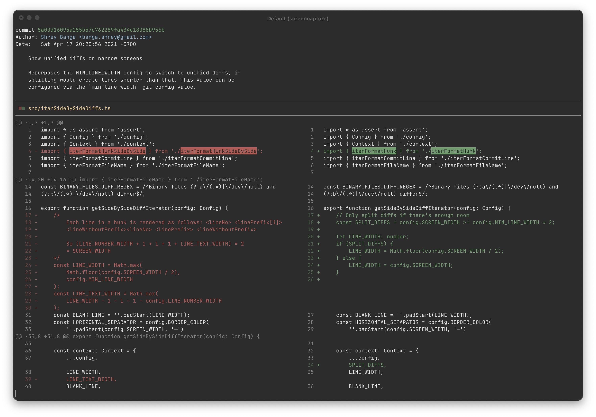
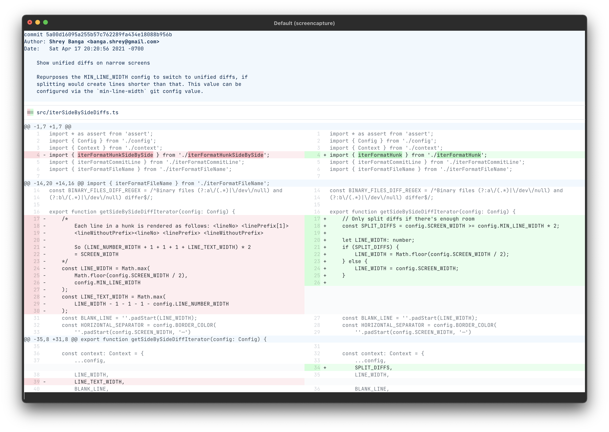
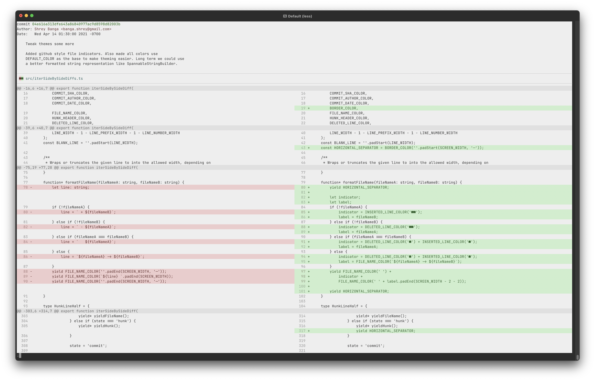
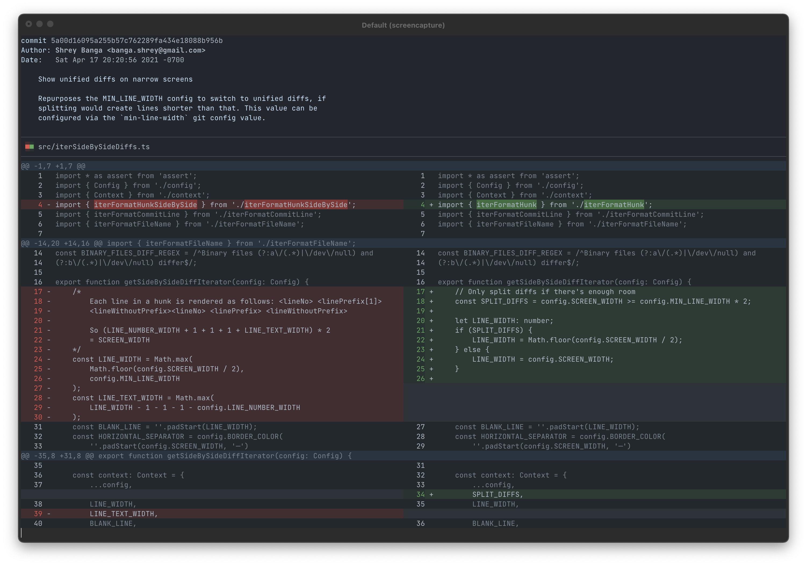

# git-split-diffs

GitHub style split diffs in your terminal.

[](https://asciinema.org/a/6MZ4GWjfIyODdts9tjnN0YPy8?t=3)

[](https://asciinema.org/a/qqkVNGVX7WyL5PQ3rfXTTISMv?t=3)

## Usage

### Install globally

```sh
npm install -g git-split-diffs

git config --global core.pager git-split-diffs --color | less -RFX
```

### Install locally

```sh
npm install git-split-diffs

git config core.pager <path>/<to>/git-split-diffs --color | less -RFX
```

### Use manually

```sh
git diff | git-split-diffs --color | less
```

## Customization

### Line wrapping

By default, lines are wrapped to fit in the screen. If you prefer to truncate them update the `wrap-lines` setting:
```
git config split-diffs.wrap-lines false
```

### Themes

You can pick between several [themes](src/themeDefinitions.ts):

#### Default

```
git config split-diffs.theme default
```


#### Light

```
git config split-diffs.theme light
```



#### GitHub Light

```
git config split-diffs.theme github-light
```


#### GitHub Dark (Dim)

```
git config split-diffs.theme github-dark-dim
```


